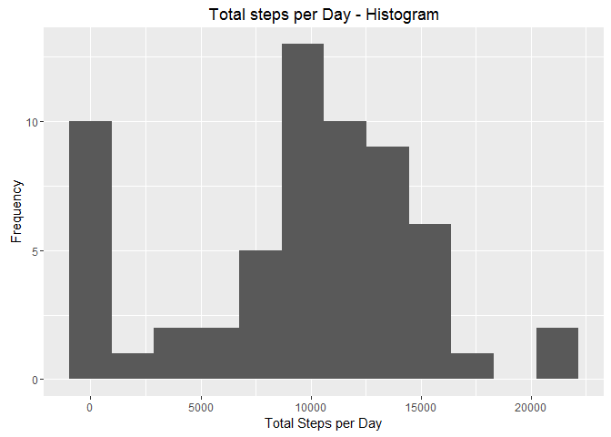
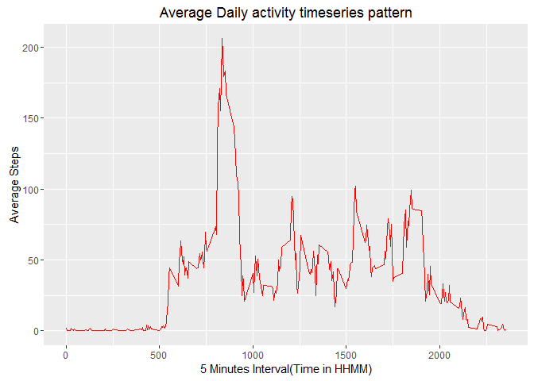
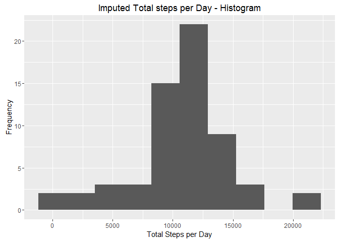
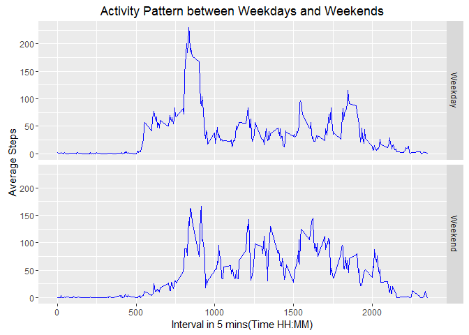

# Reproducible Research: Peer Assessment 1


## Loading and preprocessing the data

#### Data Loading

The data file is available in the working directory in .zip format. Let us unzip the data file and load them to the variable **df**. Once the data is loaded we shall look into the summary of the data with **str** command  


```r
unzip('activity.zip')
df <- read.csv('activity.csv')
str(df)
```

```
## 'data.frame':	17568 obs. of  3 variables:
##  $ steps   : int  NA NA NA NA NA NA NA NA NA NA ...
##  $ date    : Factor w/ 61 levels "2012-10-01","2012-10-02",..: 1 1 1 1 1 1 1 1 1 1 ...
##  $ interval: int  0 5 10 15 20 25 30 35 40 45 ...
```

Now the data is loaded in the variable df. This has 3 columns. Looking into the structure of data, we can find that the date column is in the format of factor. We need to convert it into Date format.

#### Data formatting


```r
df$date <- as.Date(as.character(df$date), '%Y-%m-%d')
str(df)
```

```
## 'data.frame':	17568 obs. of  3 variables:
##  $ steps   : int  NA NA NA NA NA NA NA NA NA NA ...
##  $ date    : Date, format: "2012-10-01" "2012-10-01" ...
##  $ interval: int  0 5 10 15 20 25 30 35 40 45 ...
```
Here all the data fields are in the required format.

## What is mean total number of steps taken per day?

#### Total number of steps taken per day
Total steps taken per day (*tspd*) can be find by applying the **tapply** function.

```r
tspd <- with(df, tapply(steps, date, sum, na.rm=T))
tspd
```

```
## 2012-10-01 2012-10-02 2012-10-03 2012-10-04 2012-10-05 2012-10-06 
##          0        126      11352      12116      13294      15420 
## 2012-10-07 2012-10-08 2012-10-09 2012-10-10 2012-10-11 2012-10-12 
##      11015          0      12811       9900      10304      17382 
## 2012-10-13 2012-10-14 2012-10-15 2012-10-16 2012-10-17 2012-10-18 
##      12426      15098      10139      15084      13452      10056 
## 2012-10-19 2012-10-20 2012-10-21 2012-10-22 2012-10-23 2012-10-24 
##      11829      10395       8821      13460       8918       8355 
## 2012-10-25 2012-10-26 2012-10-27 2012-10-28 2012-10-29 2012-10-30 
##       2492       6778      10119      11458       5018       9819 
## 2012-10-31 2012-11-01 2012-11-02 2012-11-03 2012-11-04 2012-11-05 
##      15414          0      10600      10571          0      10439 
## 2012-11-06 2012-11-07 2012-11-08 2012-11-09 2012-11-10 2012-11-11 
##       8334      12883       3219          0          0      12608 
## 2012-11-12 2012-11-13 2012-11-14 2012-11-15 2012-11-16 2012-11-17 
##      10765       7336          0         41       5441      14339 
## 2012-11-18 2012-11-19 2012-11-20 2012-11-21 2012-11-22 2012-11-23 
##      15110       8841       4472      12787      20427      21194 
## 2012-11-24 2012-11-25 2012-11-26 2012-11-27 2012-11-28 2012-11-29 
##      14478      11834      11162      13646      10183       7047 
## 2012-11-30 
##          0
```

#### Histogram 

**ggplot2** has been used for all the plotting functions. So loading the library here. 


```r
library(ggplot2)
qplot(tspd, bins=12, 
      xlab = 'Total Steps per Day', 
      ylab = 'Frequency',
      main = 'Total steps per Day - Histogram'
      )
```



The histogram shows that the nearly for 10 days the total number of steps has been marked as 0. And the common number of steps per day is around 10000 steps which was clocked for 13 days.

#### Mean & Median of tspd

```r
cat('Mean of total steps per day(tspd): ', mean(tspd))
```

```
## Mean of total steps per day(tspd):  9354.23
```

```r
cat('Median of total steps per day(tspd): ', median(tspd))
```

```
## Median of total steps per day(tspd):  10395
```

mean & Median of total steps per day are Mean= 9354.2295082 Median=10395 .


## What is the average daily activity pattern?

We shall find the daily activity pattern with a line chart.


```r
ggplot(df, aes(interval, steps)) +
    stat_summary(fun.y = 'mean', na.rm = T, geom = 'line', color='red') +
    labs(x='5 Minutes Interval(Time in HHMM)', y='Average Steps') +
    labs(title = 'Average Daily activity timeseries pattern')
```



#### Hightly Active time of the day

To see the highly active time of the day (in readable format) we can use the stringr and lubridate packages.


```r
library(stringr)
library(lubridate)
tspi <-tapply(df$steps, df$interval, mean, na.rm=T)
peak_hr <- names(which.max(tspi))
peak_hr <- gsub('^([0-9]{2})([0-9]+)$', '\\1:\\2', 
                str_pad(peak_hr, 4, side='left', pad='0'))
hm(peak_hr)
```

```
## [1] "8H 35M 0S"
```
From the graph there is a huge peak in the morning hrs. Exactly at **08:35**

## Imputing missing values

The total number of records with missing values can be found from **complete.cases** command.


```r
table(complete.cases(df))
```

```
## 
## FALSE  TRUE 
##  2304 15264
```
This shows that our record has 2304 rows with missing values and 15264 rows will no NA values.

##### Optional:

R provides more packages to do the detailed analysis on missing data and to impute them. Please install the packages added here, if you dont have already installed.

```r
library('mice')

md.pattern(df)
```

```
##       date interval steps     
## 15264    1        1     1    0
##  2304    1        1     0    1
##          0        0  2304 2304
```
This will give the detailed explaination of how the data is missing. How many rows have missing values for a paticular field? This pattern easily explains that only the steps variable has the missing value.

The other package VIM - 'Visualization and Imputation of Missing Values' allows us to visualize the missing data.


```r
library('VIM')

aggr_plot <- aggr(df, col=c('navyblue','red'), numbers=TRUE, sortVars=TRUE, 
                   labels=names(data), cex.axis=.7, gap=3, 
                   ylab=c("Histogram of missing data","Pattern"))
```


```
## 
##  Variables sorted by number of missings: 
##  Variable     Count
##     steps 0.1311475
##      date 0.0000000
##  interval 0.0000000
```
Here it shows that the 13% of the steps column is having missing value(NA)

### Analyzing Missing Values

Before filling the missing values lets do a little analysis on the steps column. Lets see the summary of the steps column. 

```r
summary(df$steps)
```

```
##    Min. 1st Qu.  Median    Mean 3rd Qu.    Max.    NA's 
##    0.00    0.00    0.00   37.38   12.00  806.00    2304
```
We already know that 13% of the data is having missing values. Now the **Median** of the steps column is found as 0, which means more data is have 0 as a value.


```r
cat('Number of records with atleast 1 step:', 
      nrow(df[df$steps!=0 & !is.na(df$steps),]))
```

```
## Number of records with atleast 1 step: 4250
```

### Imputing Missing Values

Since most of the records are having 0 values. We can let mice to handle the imputation. But one drawback with mice() is that it will not work for the data with DATE field. As we have a data field with DATE datatype we can not use mice() here. But it is worth having a look into it. Here is a nice article on [Imputing Missing data with MICE](http://datascienceplus.com/imputing-missing-data-with-r-mice-package/).  

Let us impute the data manually. Here imputing is based on the Mean steps per interval. I have preffered to go with *interval* rather than *date* since few date have all the steps value as NA. eg: '2010-10-01'


```r
df[is.na(df$steps),1] <- tapply(df$steps, df$interval, mean, na.rm=T)

summary(df$steps)
```

```
##    Min. 1st Qu.  Median    Mean 3rd Qu.    Max. 
##    0.00    0.00    0.00   37.38   27.00  806.00
```

Now we have imputed the missing values in the *steps* field.


```r
imputed_tspd <- tapply(df$steps, df$date, sum)
qplot(imputed_tspd, bins=10, 
      xlab = 'Total Steps per Day', 
      ylab = 'Frequency',
      main = 'Imputed Total steps per Day - Histogram'
      ) 
```



Now we can see a notable change in the histogram shape. Early there was some peak at the left end of the chart. Now the histogram is almost in bell shape.

```r
summary(imputed_tspd)
```

```
##    Min. 1st Qu.  Median    Mean 3rd Qu.    Max. 
##      41    9819   10770   10770   12810   21190
```

The mean and median has change compared to the previous records. 


## Are there differences in activity patterns between weekdays and weekends?

To check the pattern between weekdays and weekend activities, let us extract the *daytype* from *date*.

```r
df$daytype <- as.factor(weekdays(df$date))
levels(df$daytype) <- list('Weekday'=c('Monday','Tuesday','Wednesday','Thursday','Friday'), 'Weekend'=c('Saturday','Sunday'))
str(df)
```

```
## 'data.frame':	17568 obs. of  4 variables:
##  $ steps   : num  1.717 0.3396 0.1321 0.1509 0.0755 ...
##  $ date    : Date, format: "2012-10-01" "2012-10-01" ...
##  $ interval: int  0 5 10 15 20 25 30 35 40 45 ...
##  $ daytype : Factor w/ 2 levels "Weekday","Weekend": 1 1 1 1 1 1 1 1 1 1 ...
```

Plattern between the weekday and weekend activities.

```r
g <- ggplot(data=df, aes(interval, steps)) + 
        stat_summary(fun.y = 'mean', geom = 'line', color='blue') + 
        facet_grid(facets = daytype~. ) + 
        labs(x='Interval in 5 mins(Time HH:MM)', y='Average Steps') +
        labs(title='Activity Pattern between Weekdays and Weekends')
print(g)
```



We can find clear pattern in between weekday and the weekends.

1. **Weekdays:** People are more active during Morning hrs. May be getting ready for office or school, colleges. And the activites as low during middle of the day and little peak at the evening hrs. 

2. **Weekends:** People are active equally all over the day time but not much active than week days. This is understandable :)

We can also notice that during night hrs the activites are nearly equal to zero.
